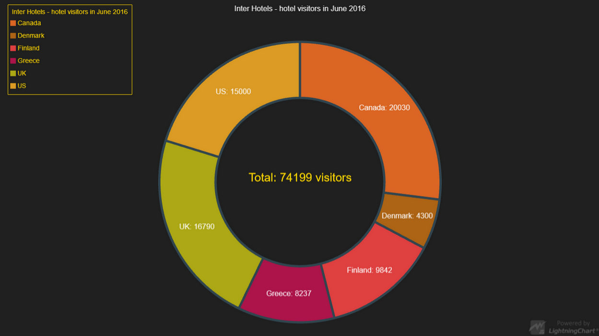

# Donut Chart



This demo application belongs to the set of examples for LightningChart JS, data visualization library for JavaScript.

LightningChart JS is entirely GPU accelerated and performance optimized charting library for presenting massive amounts of data. It offers an easy way of creating sophisticated and interactive charts and adding them to your website or web application.

The demo can be used as an example or a seed project. Local execution requires the following steps:

- Make sure that relevant version of [Node.js](https://nodejs.org/en/download/) is installed
- Open the project folder in a terminal:

        npm install              # fetches dependencies
        npm start                # builds an application and starts the development server

- The application is available at *http://localhost:8080* in your browser, webpack-dev-server provides hot reload functionality.


## Description

Donut Chart is a variation of Pie chart - functionally it's the same, visually it's only missing the center.

The chart can be created with a few simple lines of code.

The inner radius is used to set how far inwards from the outer edge of the circle we should cut the circle from, essentially creating a ring.
For example, setting the inner radius as 0.50 will draw a ring, where the circle's inner radius is at 50% distance from the circle's full radius.

```javascript
// Create a new Pie Chart.
const chart = lightningChart().Pie()
chart.setInnerRadius(50)
```

It is possible to disable the animations for the Pie / Donut chart: value changes, disabling / enabling slices and the explosion / implosion of a slice.
Animations are enabled by default.

```javascript
// Disable all animations for the chart.
chart.setAnimationsEnabled( false )
```

The slice fill styles can be styled by using a palette. A palette is a collection of fill styles which can be called by index.

```javascript
// Use a palette of colors to create the Fill Styles. You can also create your own 
// - check the ColorPalettes documentation for more info.
const colorPalette = ColorPalettes.fullSpectrum
// Create a palette of Fill Styles to use with the Pie Chart's Slices.
const fillStylePalette = SolidFillPalette( colorPalette, 10 )
pie.setSliceFillStyle( fillStylePalette )
```

You can also create a custom color palette and use it with the Chart.
Easiest way to add a custom color palette is to create an array of colors and creating a function that returns colors from the array based on index.

```javascript
// ----- Create custom Palette for Donut (defines color of Slice filling) ----
const colorArray = [
    ColorRGBA( 97, 33, 15, 255 ),
    ColorRGBA( 255, 140, 66, 255 ),
    ColorRGBA( 225, 86, 52, 255 ),
    ColorRGBA( 234, 43, 31, 255 ),
    ColorRGBA( 249, 223, 116, 255 ),
    ColorRGBA( 245, 224, 183, 255 )
]
// Create a simple function which returns a color based on index. 
// Both parameters (length and index) can be used to create more complex functions -
// length should be the length of the color array.
const colorPalette = ( length ) => ( index ) => {
    return colorArray[index]
}
// Pass the color palette to the SolidFillPalette method,
// which returns a fillStyle palette that can be used with the Donut Chart
const fillStylePalette = SolidFillPalette( colorPalette, data.values.length)
// Set the custom fillStyle for the Donut Chart
donut.setSliceFillStyle( fillStylePalette )
```

All slices in the chart can have a border surrounding them, which can be styled for the entire chart.

```javascript
// Create a StrokeStyle to use with the chart.
const customStrokeStyle = new SolidLine(
    {
        fillStyle: new SolidFill(
            { color: ColorRGBA(30,144,255) }
        ),
         thickness: 5
    }
)
// Set the StrokeStyle to use with all slices in the chart.
chart.setSliceStrokeStyle( customStrokeStyle )
```


## API Links

* Pie chart: [PieChart]
* Pie Slice label formatter: [SliceLabelFormatter]
* Color Palette: [Palette]
* Solid Fill Palette: [SolidFillPalette]
* Solid Line: [SolidLine]
* Solid Fill: [SolidFill]


## Support

If you notice an error in the example code, please open an issue on [GitHub][0] repository of the entire example.

Official [API documentation][1] can be found on [Arction][2] website.

If the docs and other materials do not solve your problem as well as implementation help is needed, ask on [StackOverflow][3] (tagged lightningchart).

If you think you found a bug in the LightningChart JavaScript library, please contact support@arction.com.

Direct developer email support can be purchased through a [Support Plan][4] or by contacting sales@arction.com.

[0]: https://github.com/Arction/
[1]: https://www.arction.com/lightningchart-js-api-documentation/
[2]: https://www.arction.com
[3]: https://stackoverflow.com/questions/tagged/lightningchart
[4]: https://www.arction.com/support-services/

© Arction Ltd 2009-2020. All rights reserved.


[PieChart]: https://www.arction.com/lightningchart-js-api-documentation/v1.3.0/classes/piechart.html
[SliceLabelFormatter]: https://www.arction.com/lightningchart-js-api-documentation/v1.3.0/globals.html#slicelabelformatter
[Palette]: https://www.arction.com/lightningchart-js-api-documentation/v1.3.0/globals.html#palette
[SolidFillPalette]: https://www.arction.com/lightningchart-js-api-documentation/v1.3.0/globals.html#solidfillpalette
[SolidLine]: https://www.arction.com/lightningchart-js-api-documentation/v1.3.0/classes/solidline.html
[SolidFill]: https://www.arction.com/lightningchart-js-api-documentation/v1.3.0/classes/solidfill.html

